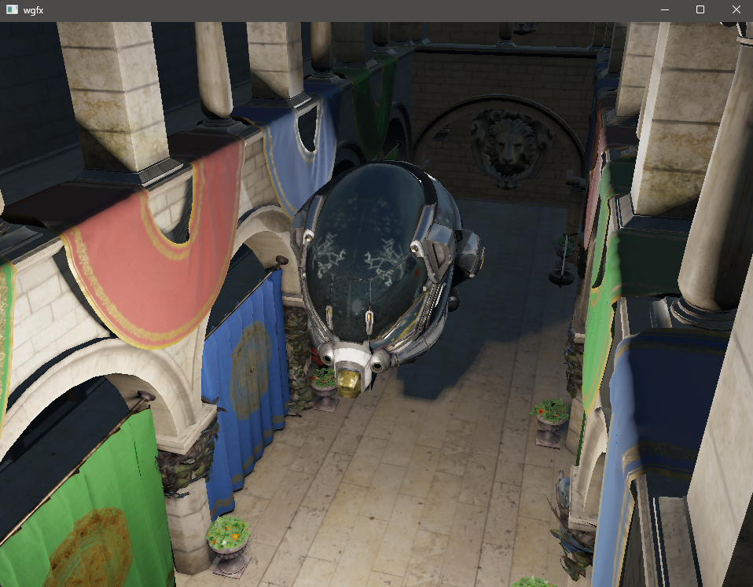

# wgfx

A small C++17 graphics library built with OpenGL, GLFW, GLAD, GLM, and CMake.




## Current Features

- OBJ, glTF, and GLB model loading
- PBR materials and image-based lighting
- Cubemap skyboxes
- Directional, point, and spot light types
- Camera-fitted cascaded shadows for directional lights
- Perspective shadow maps for spotlights
- Cubemap shadow maps for point lights
- Hardware-filtered PCF shadow sampling
- Reusable GLSL lighting code through relative shader includes
- Camera and input controls

## Dependencies

- [GLFW](https://github.com/glfw/glfw)
- [GLAD](https://github.com/Dav1dde/glad)
- [GLM](https://github.com/g-truc/glm)
- [fastgltf](https://github.com/spnda/fastgltf)
- [tinyobjloader](https://github.com/tinyobjloader/tinyobjloader)
- [stb](https://github.com/nothings/stb)

## Assets

- [Sponza Optimized](https://github.com/toji/sponza-optimized)
- [Damaged Helmet](https://github.com/KhronosGroup/glTF-Sample-Assets/tree/main/Models/DamagedHelmet)
- [Lava Assets](https://github.com/Breush/lava-assets)

## Build

```powershell
cmake -S . -B build-clang -G Ninja -DCMAKE_C_COMPILER=clang -DCMAKE_CXX_COMPILER=clang++
cmake --build build-clang
.\build-clang\wgfx.exe
```

## Controls

- `W`, `A`, `S`, `D`: Move horizontally
- `Q`, `E`: Move up and down
- Left mouse drag: Look around
- `Escape`: Close the application

## Next

- [ ] Add an ImGui interface
- [ ] Implement SSAO
- [ ] Improve PBR and environment lighting
- [ ] Add a Vulkan backend later
- [ ] HDR
- [ ] MSAA
