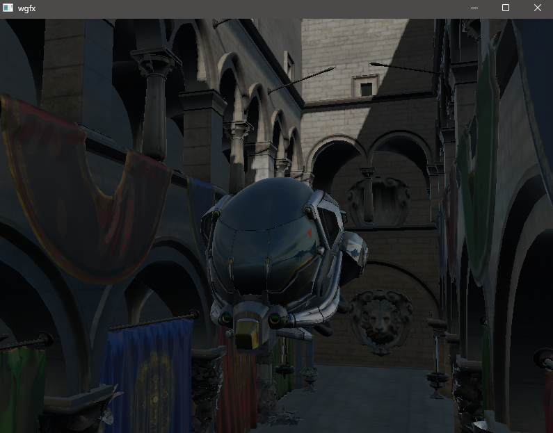

# wgfx

A small C++17 graphics renderer built with OpenGL, GLFW, GLAD, GLM, and CMake.



## Current Features

- OBJ, glTF, and GLB model loading
- PBR materials and image-based lighting
- Cubemap skyboxes
- Directional shadow mapping
- Camera and input controls

## Dependencies

- [GLFW](https://github.com/glfw/glfw)
- [GLAD](https://github.com/Dav1dde/glad)
- [GLM](https://github.com/g-truc/glm)
- [fastgltf](https://github.com/spnda/fastgltf)
- [tinyobjloader](https://github.com/tinyobjloader/tinyobjloader)
- [stb](https://github.com/nothings/stb)

## Assets

- [Sponza Optimized](https://github.com/toji/sponza-optimized)

## Build

```powershell
cmake -S . -B build-clang -G Ninja -DCMAKE_C_COMPILER=clang -DCMAKE_CXX_COMPILER=clang++
cmake --build build-clang
```

## Next

- Add an ImGui interface
- Create a reusable lighting system
- Implement SSAO
- Improve PBR and environment lighting
- Add a Vulkan backend later
