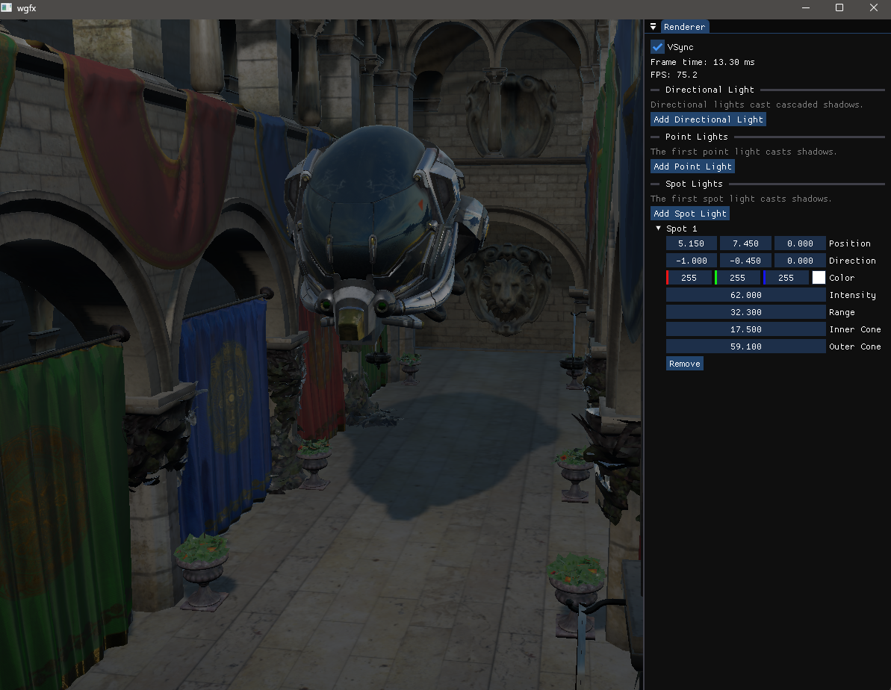
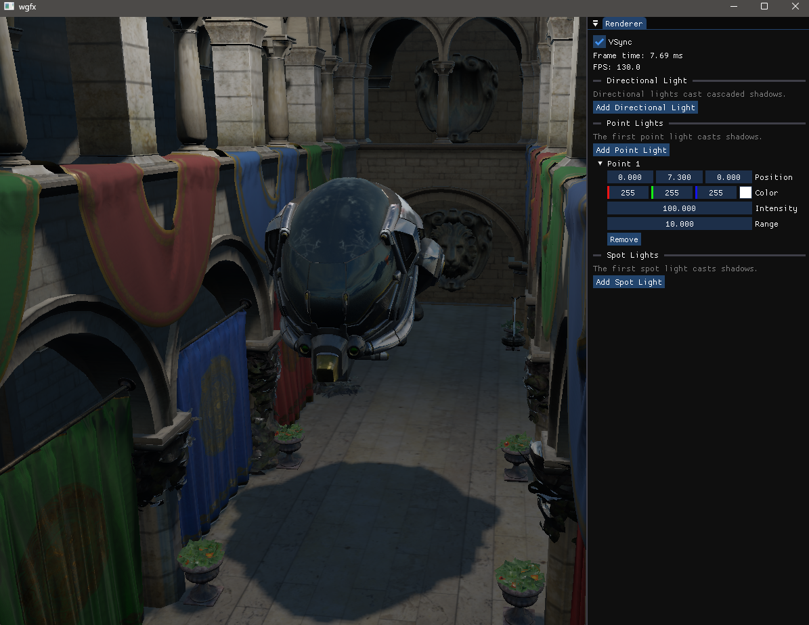

# wgfx

A C++20 graphics project with OpenGL and Vulkan backends, built with GLFW, GLAD, GLM, the Vulkan SDK, and CMake.





## Current Features

- OBJ, glTF, and GLB model loading
- PBR materials and image-based lighting
- Cubemap skyboxes
- Directional, point, and spot light types
- Camera-fitted cascaded shadows for directional lights
- Perspective shadow maps for spotlights
- Cubemap shadow maps for point lights
- Hardware-filtered PCF shadow sampling
- Hybrid static and dynamic shadow-map rendering
- Reusable GLSL lighting code through relative shader includes
- Off-screen OpenGL rendering with a 3x3 edge-detection post-processing kernel
- Runtime-selectable 8x MSAA with a multisampled scene FBO and single-sample post-processing FBO
- RAII wrappers for OpenGL VAOs, VBOs, EBOs, and framebuffers
- Dockable Dear ImGui controls for lights, performance, VSync, and MSAA
- Camera and input controls
- Vulkan device, swap chain, render pass, graphics pipeline, command buffers, and synchronized presentation
- Automatic Vulkan GLSL-to-SPIR-V compilation through `glslc`

## Dependencies

- [GLFW](https://github.com/glfw/glfw)
- [GLAD](https://github.com/Dav1dde/glad)
- [GLM](https://github.com/g-truc/glm)
- [fastgltf](https://github.com/spnda/fastgltf)
- [tinyobjloader](https://github.com/tinyobjloader/tinyobjloader)
- [stb](https://github.com/nothings/stb)
- [Dear ImGui](https://github.com/ocornut/imgui)
- [LunarG Vulkan SDK](https://vulkan.lunarg.com/)

## Assets

- [Sponza](https://github.com/KhronosGroup/glTF-Sample-Models/tree/main/2.0/Sponza)
- [Damaged Helmet](https://github.com/KhronosGroup/glTF-Sample-Assets/tree/main/Models/DamagedHelmet)
- [Lava Assets](https://github.com/Breush/lava-assets)

## Build

```powershell
cmake -S . -B build-clang -G Ninja -DCMAKE_C_COMPILER=clang -DCMAKE_CXX_COMPILER=clang++
cmake --build build-clang
.\build-clang\wgfx.exe
```

## Backend Selection

- `wgfx.exe -V` or `wgfx.exe -Vulkan`: Force the Vulkan renderer
- `wgfx.exe -O` or `wgfx.exe -OpenGL`: Force the OpenGL renderer
- `wgfx.exe`: Prefer Vulkan when a loader and compatible driver are available, otherwise fall back to OpenGL

The OpenGL renderer contains the full PBR scene, shadows, ImGui controls, and framebuffer post-processing. The Vulkan renderer currently draws a basic triangle through its swap chain and graphics pipeline, can't resize right now the Vulkan window, resizing will end up falling back the OpenGL renderer.

## Project Layout

- `include/`: Public C++ headers
- `src/`: C++ implementation files
- `res/shaders/GL/`: OpenGL shaders, post-processing shaders, and shared shader includes
- `res/shaders/vulkan/`: Vulkan GLSL sources and generated `*.spv` binaries
- `main.cpp`: Application entry point

All library-owned C++ APIs are declared in the `wgfx` namespace.

## Controls

- `W`, `A`, `S`, `D`: Move horizontally
- `Q`, `E`: Move up and down
- Left mouse drag: Look around
- `Escape`: Close the application
- Renderer panel: Toggle VSync and 8x MSAA at runtime

## Next

- [ ] Implement SSAO
- [ ] Improve PBR and environment lighting
- [ ] HDR
- [ ] Vulkan swap-chain recreation and resize handling

## References
- [LearnOpenGL](https://learnopengl.com/)
- [Vulkan Game Engine by Brendan Galea](https://www.youtube.com/playlist?list=PL8327DO66nu9qYVKLDmdLW_84-yE4auCR)
- [TU Wien Vulkan Lecture Series](https://www.youtube.com/playlist?list=PLmIqTlJ6KsE1Jx5HV4sd2jOe3V1KMHHgn)
- [OpenGL Tutorials by Victor Gordan](https://www.youtube.com/playlist?list=PLPaoO-vpZnumdcb4tZc4x5Q-v7CkrQ6M-)