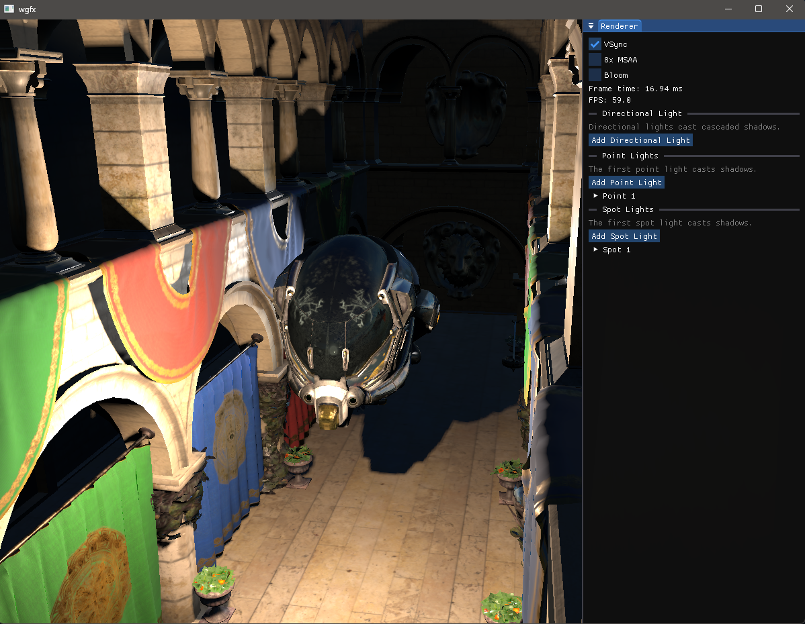
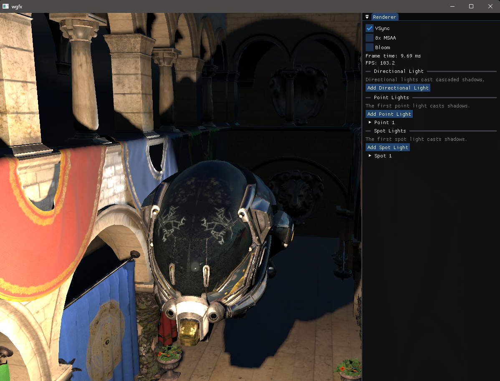
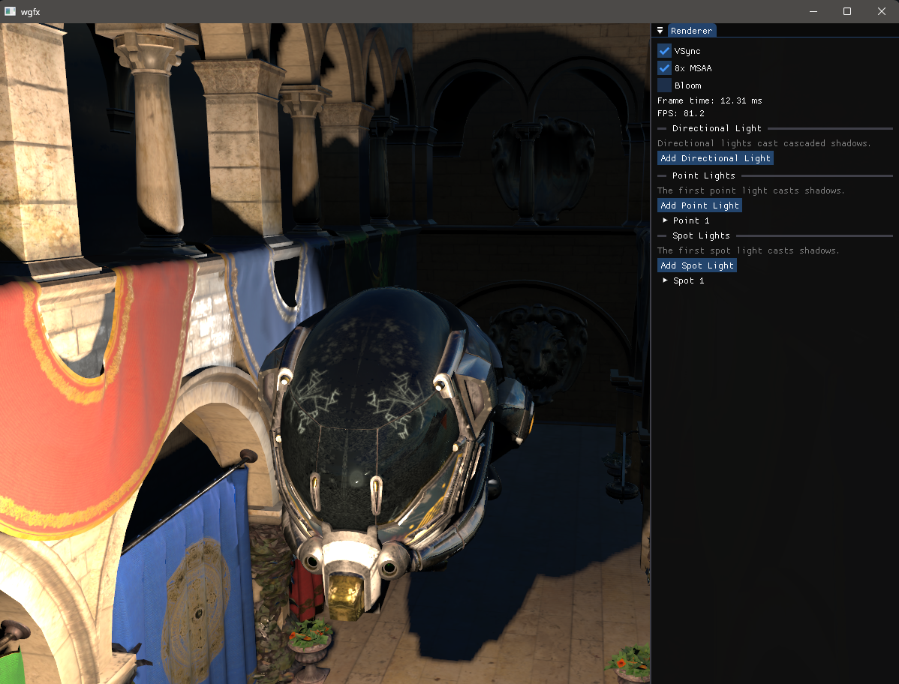
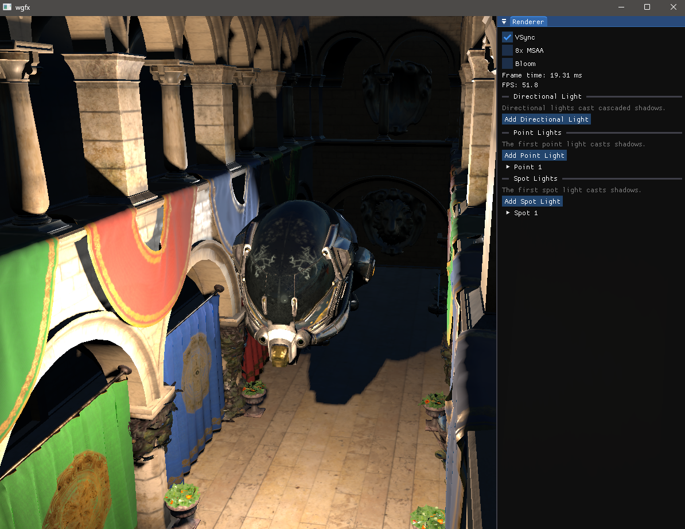
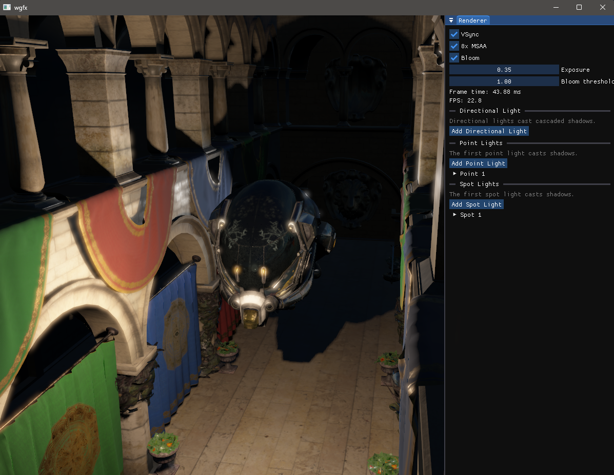

# wgfx

A C++20 graphics project with an OpenGL backend, built with GLFW, GLAD, GLM, and CMake.

## Screenshots

### Bloom

<table>
  <tr>
    <th>Bloom disabled</th>
    <th>Bloom enabled</th>
  </tr>
  <tr>
    <td></td>
    <td></td>
  </tr>
</table>

### Multisampling

<table>
  <tr>
    <th>MSAA disabled</th>
    <th>8x MSAA enabled</th>
  </tr>
  <tr>
    <td></td>
    <td></td>
  </tr>
</table>

### Combined Post-Processing

<table>
  <tr>
    <th>Bloom and MSAA disabled</th>
    <th>Bloom and 8x MSAA enabled</th>
  </tr>
  <tr>
    <td></td>
    <td></td>
  </tr>
</table>

## Current Features

- OBJ, glTF, and GLB model loading
- PBR materials and image-based lighting
- Cubemap skyboxes
- Directional, point, and spot light types
- Camera-fitted cascaded shadows for directional lights
- Perspective shadow maps for spotlights
- Cubemap shadow maps for point lights
- Hardware-filtered PCF shadow sampling
- Hybrid static and dynamic shadow-map rendering
- Reusable GLSL lighting code through relative shader includes
- HDR rendering with exposure tone mapping and optional Gaussian-blurred bloom
- Runtime-selectable 8x MSAA with a multisampled scene FBO and single-sample post-processing FBO
- RAII wrappers for OpenGL VAOs, VBOs, EBOs, and framebuffers
- Dockable Dear ImGui controls for lights, performance, VSync, MSAA, bloom, exposure, and bloom threshold
- Camera and input controls

## Dependencies

- [GLFW](https://github.com/glfw/glfw)
- [GLAD](https://github.com/Dav1dde/glad)
- [GLM](https://github.com/g-truc/glm)
- [fastgltf](https://github.com/spnda/fastgltf)
- [tinyobjloader](https://github.com/tinyobjloader/tinyobjloader)
- [stb](https://github.com/nothings/stb)
- [Dear ImGui](https://github.com/ocornut/imgui)

## Assets

- [Sponza](https://github.com/KhronosGroup/glTF-Sample-Models/tree/main/2.0/Sponza)
- [Damaged Helmet](https://github.com/KhronosGroup/glTF-Sample-Assets/tree/main/Models/DamagedHelmet)
- [Lava Assets](https://github.com/Breush/lava-assets)

## Build

```powershell
cmake -S . -B build-clang -G Ninja -DCMAKE_C_COMPILER=clang -DCMAKE_CXX_COMPILER=clang++
cmake --build build-clang
.\build-clang\wgfx.exe
```

## Project Layout

- `include/`: Public C++ headers
- `src/`: C++ implementation files
- `res/shaders/GL/`: OpenGL shaders, post-processing shaders, and shared shader includes
- `main.cpp`: Application entry point

All library-owned C++ APIs are declared in the `wgfx` namespace.

## Controls

- `W`, `A`, `S`, `D`: Move horizontally
- `Q`, `E`: Move up and down
- Left mouse drag: Look around
- `Escape`: Close the application
- Renderer panel: Toggle VSync, 8x MSAA, and bloom; adjust exposure and bloom threshold

## Next

- [ ] Implement SSAO
- [ ] Improve PBR and environment lighting

## References
- [LearnOpenGL](https://learnopengl.com/)
- [OpenGL Tutorials by Victor Gordan](https://www.youtube.com/playlist?list=PLPaoO-vpZnumdcb4tZc4x5Q-v7CkrQ6M-)
